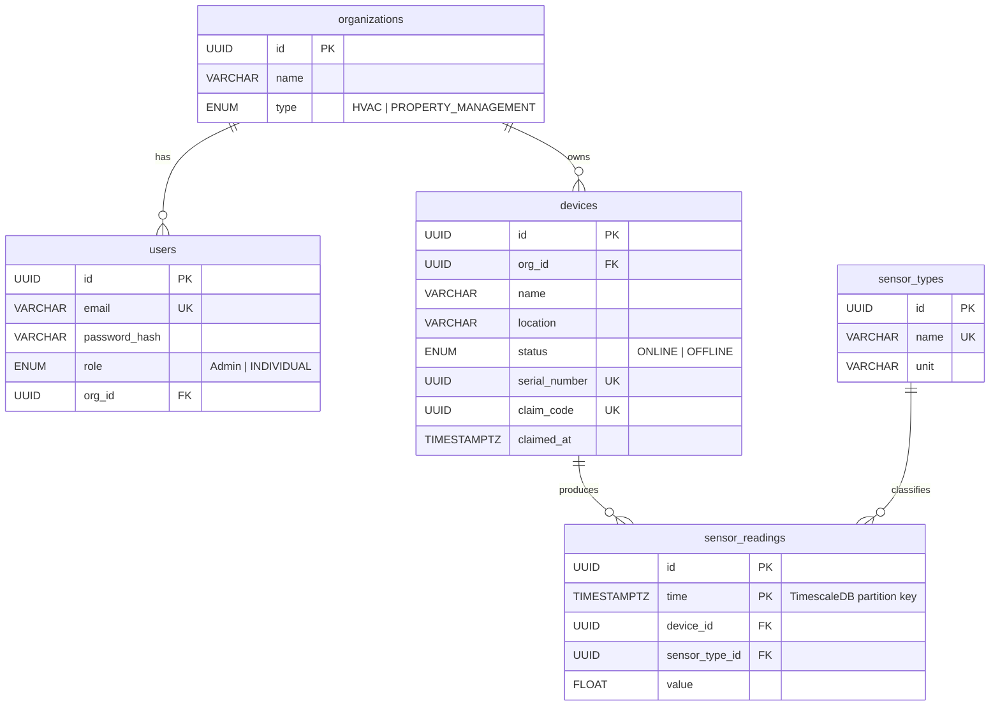

# STA — Smart HVAC IoT Platform

A full-stack IoT platform for monitoring and managing HVAC systems in real time. Organizations can register devices, stream sensor data over MQTT, and view analytics through a web dashboard.

## Architecture

```
┌─────────────────┐     ┌──────────────────┐     ┌──────────────┐
│  Next.js 16     │────▶│  FastAPI Server  │────▶│ TimescaleDB  │
│  Dashboard      │     │  (Python 3.13)   │     │ (PostgreSQL) │
└─────────────────┘     └──────────────────┘     └──────────────┘
                                │                        
                         ┌──────┴──────┐               
                         │  Mosquitto  │  Redis         
                         │  (MQTT)     │  (Sessions)    
                         └─────────────┘               
```

| Service     | Technology              | Port |
|-------------|-------------------------|------|
| Dashboard   | Next.js 16 + Tailwind   | 3000 |
| API Server  | FastAPI + SQLAlchemy    | 8000 |
| Database    | TimescaleDB (pg17)      | 5433 |
| MQTT Broker | Eclipse Mosquitto 2     | 1883 |
| Cache       | Redis 7                 | 6379 |

## Features

- **Device management** — register, claim, and track IoT sensor devices via claim codes
- **Real-time sensor data** — time-series storage with TimescaleDB hypertables; live updates over WebSocket
- **Multi-tenancy** — organizations (HVAC, Property Management) with role-based access (Admin, Individual)
- **Auth** — JWT + Redis session management; Google SSO support
- **Email** — transactional email via FastAPI-Mail (e.g., claim code delivery)
- **REST API** — fully documented at `/docs` (Swagger UI)

## Prerequisites

- Docker & Docker Compose
- Node.js 20+ (for local dashboard development)
- Python 3.13+ (for local server development)

## Getting Started

### 1. Configure environment variables

Copy the example and fill in your values:

```bash
cp .env.example .env
```

Required variables:

| Variable            | Description                        |
|---------------------|------------------------------------|
| `POSTGRES_USER`     | PostgreSQL username                |
| `POSTGRES_PASSWORD` | PostgreSQL password                |
| `POSTGRES_DB`       | PostgreSQL database name           |
| `REDIS_PASSWORD`    | Redis password                     |

The server also reads from `server/.env`:

| Variable         | Description                        |
|------------------|------------------------------------|
| `DATABASE_URL`   | Full PostgreSQL connection string  |
| `SECRET_KEY`     | JWT signing key                    |
| `GOOGLE_CLIENT_ID` / `GOOGLE_CLIENT_SECRET` | Google SSO credentials (optional) |

### 2. Start infrastructure (database, Redis, MQTT)

```bash
docker compose -f compose.infra.yml up -d
```

### 3. Start application services

```bash
docker compose -f compose.app.yml up
```

The dashboard will be available at `http://localhost:3000` and the API at `http://localhost:8000`.

> In `development` mode the server drops and recreates all tables on startup, then seeds sample data.

---

## Local Development

### Server (FastAPI)

```bash
cd server
python -m venv .venv && source .venv/bin/activate
pip install -r requirements.txt
uvicorn main:app --reload --port 8000
```

### Dashboard (Next.js)

```bash
cd dashboard
npm install
npm run dev
```

### Running tests

```bash
cd server
pytest
```

---

## API Overview

Base path: `/api`

| Prefix              | Description                    |
|---------------------|--------------------------------|
| `/auth`             | Register, login, logout, SSO   |
| `/devices`          | CRUD + claim flow              |
| `/sensor_readings`  | Ingest and query readings      |
| `/sensor_types`     | Manage sensor type definitions |
| `/organizations`    | Organization management        |
| `/users`            | User profile & admin ops       |
| `/email`            | Send transactional emails      |
| `/ws/{client_id}`   | WebSocket for live data        |
| `/health`           | Health check                   |

Interactive docs: `http://localhost:8000/docs`

---

## Data Model



`sensor_readings` is a TimescaleDB hypertable partitioned by `time`.

---

## Project Structure

```
STA/
├── compose.infra.yml       # Database, Redis, Mosquitto
├── compose.app.yml         # Server + Dashboard
├── server/                 # FastAPI backend
│   ├── api/endpoints/      # Route handlers
│   ├── models/             # SQLAlchemy ORM models
│   ├── schemas/            # Pydantic request/response schemas
│   ├── crud/               # Database operations
│   ├── config/             # DB, Redis, SSO config
│   ├── enums/              # Shared enums
│   ├── lib/                # Email, session utilities
│   ├── utils/              # Auth helpers
│   ├── scripts/seed.py     # Dev seed data
│   └── tests/              # pytest test suite
└── dashboard/              # Next.js frontend
    ├── app/(marketing)/    # Public landing page
    ├── app/(auth)/         # Login / register pages
    ├── app/(protected)/    # Authenticated dashboard
    ├── api/                # API client functions
    ├── components/         # Shared UI components (shadcn)
    ├── context/            # Auth & theme providers
    └── types/              # TypeScript type definitions
```
