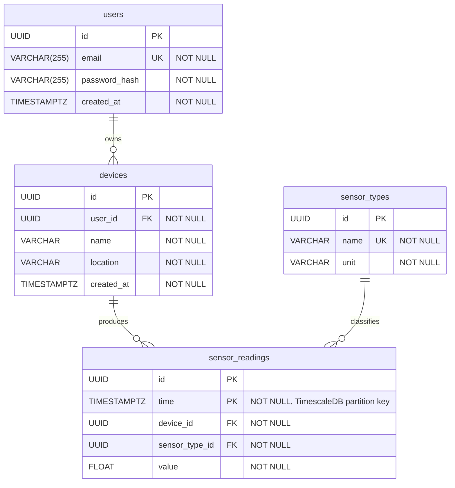

# Database UML

## Notes

- `users` ↔ `devices`: unique constraint on `(user_id, name)` — a user cannot have two devices with the same name.
- `sensor_readings` is a **TimescaleDB hypertable** partitioned by `time`. The primary key is composite `(id, time)`.
- Cascade delete-orphan is set on `users → devices` and `devices → sensor_readings`.
